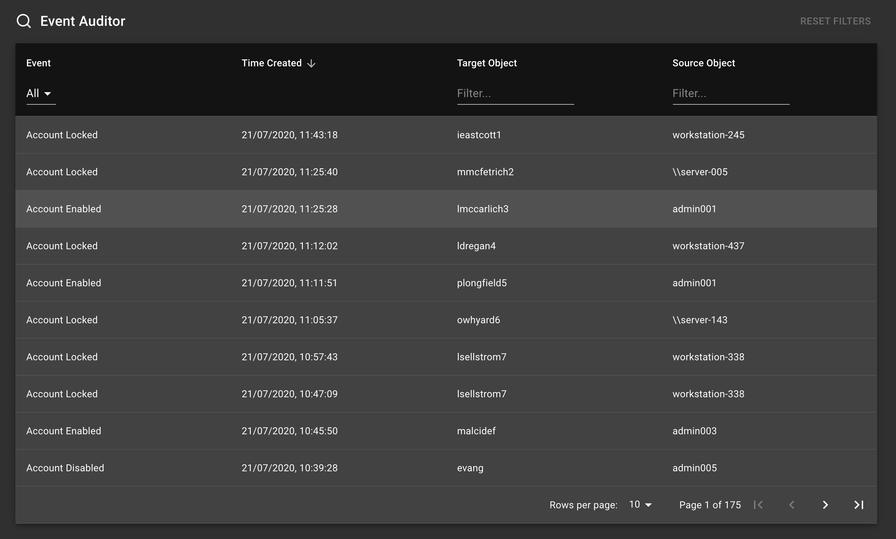

# Event-Auditor

[](https://github.com/richardbristow/event-auditor/actions/workflows/lint-test-build.yml)

A Material-UI SPA to quickly and easily view and search active directory event logs.



## Installation

Clone repository, and install dependencies:

```shell
  git clone https://github.com/richardbristow/event-auditor.git
  cd event-auditor
  npm install
```

### API

The API serves the saved Active Directory audit logs from a mongo database, this will have to be setup first.\
To populate the database a powerhsell script is included that can be run via a scheduled task (saveEventsToDb.ps1). This script collects the specified Events (via Event ID) that occurred since the last run from the Windows Event History, and saves them to the database using the PowerShell module [Mdbc](https://github.com/nightroman/Mdbc).\
The script will most likely have to be customised to run in your specific environment, and can also be edited to save other events in addition to the three included (Account Locked, Account Enabled, Account Disabled).

Start the API:

```start
  npm run start-api
```

### Environment variables

Before starting the app the below environemnt variables need to be specified in a .env file in the root directory.

The express ports being the port the API server will run on.\
The API urls will be in the format <http://server:port/api>, for example if running locally the URL might be <http://localhost:3001/api>.\
The database name and mongo connection url variables are the name given to the mongo database and the url for the API server to connect to the database respectively.

```env
EXPRESS_PORT_DEV=<API_DEV_PORT>
EXPRESS_PORT_PROD=<API_PROD_PORT>
REACT_APP_API_URL_DEV=<API_URL_DEV>
REACT_APP_API_URL_PROD=<API_URL_PROD>
DATABASE_NAME=<DATABASE_NAME>
MONGO_CONNECTION_URL=<MONGO_DB_URL>
SERVE_PORT=<SERVE_PROD_PORT>
```

### Frontend

Start the app:

```shell
  npm start
```

Run tests:

```shell
  npm test
```

Lint code:

```shell
  npm run lint     # lint javascript and css
  npm run lint:js  # lint javascript
  npm run lint:css # lint css
```

Build:

```shell
  npm run build
```

## Other Info

This project was bootstrapped with [Create React App](https://github.com/facebook/create-react-app).

Create React App [documentation](https://create-react-app.dev/docs/getting-started).
